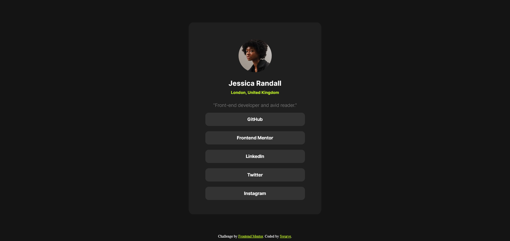

# Frontend Mentor - Social links profile solution

This is a solution to the [Social links profile challenge on Frontend Mentor](https://www.frontendmentor.io/challenges/social-links-profile-UG32l9m6dQ). Frontend Mentor challenges help you improve your coding skills by building realistic projects.

## Table of contents

- [Overview](#overview)
  - [The challenge](#the-challenge)
  - [Screenshot](#screenshot)
  - [Links](#links)
- [My process](#my-process)
  - [Built with](#built-with)
  - [What I learned](#what-i-learned)
  - [Continued development](#continued-development)
  - [Useful resources](#useful-resources)

## Overview

### The challenge

Users should be able to:

- See hover and focus states for all interactive elements on the page

### Screenshot



### Links

- Solution URL: [Solution](https://github.com/SwurveBoi/Frontendmentor-Solutions/tree/main)
- Live Site URL: [Add live site URL here](https://your-live-site-url.com)

## My process

### Built with

- Flexbox

### What I learned

This is what I learned during this challenge:

```css
Better understanding of how flexbox is utilized .prof-links {
  display: flex;
  gap: 1em;
  flex-direction: column;
  align-items: center;
}
```

### Continued development

I really wanna learn more about media queries as I can't really wrap my head around at the moment.

### Useful resources

- [CSS Tricks](https://css-tricks.com/snippets/css/a-guide-to-flexbox/#aa-properties-for-the-parentflex-container) - Really helped understand how to use flexbox layout.
